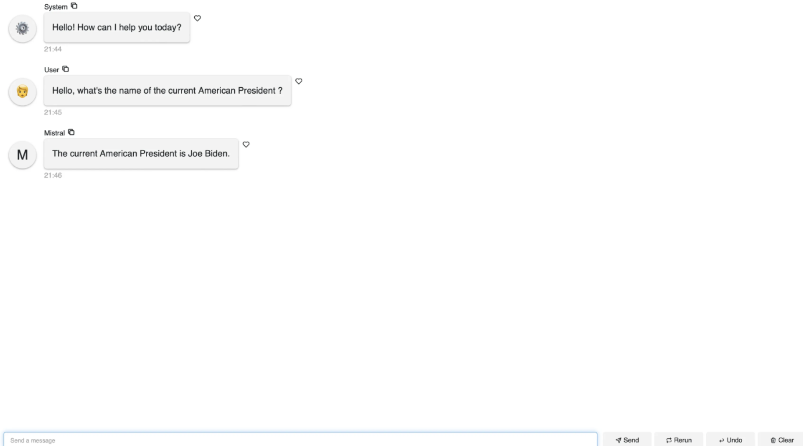

# Conversational AI with Panel and Mistral


This project demonstrates how to build an interactive conversational AI web application using Panel and one of the Mistral model. The application allows users to interact with a chatbot that remembers the conversation history and responds accordingly.

## Features

- Interactive chat interface
- Conversation memory for context-aware responses
- Responses generated by the advanced Mistral conversational model
- Simple and intuitive UI built with Panel

## Prerequisites

Before running this application, you will need:

- Python 3.8 or higher
- Panel
- CTransformers library
- Internet connection for model download

## Installation

To set up the environment and run the application, follow these steps:

1. Clone the repository:
   ```bash
   git clone https://github.com/[your-username]/[repository-name].git
   ```
2. Navigate into the project directory:
   ```bash
   cd [repository-name]
   ```
3. Install the required Python packages:
   ```bash
   pip install panel ctransformers
   ```

## Usage

To start the application, run the following command in your terminal:

```bash
panel serve app.py
```

After starting the server, open your web browser and navigate to the URL provided in the terminal (usually http://localhost:5006/app).

## How It Works

The application utilizes Panel for the web interface and the Mistral model for generating conversational responses. Users can enter questions or statements, and the chatbot, powered by Mistral, will provide appropriate responses based on the conversation history.

## Contributing

Contributions to this project are welcome! Please fork the repository and submit a pull request with your changes.

## Support

If you encounter any problems or have questions, feel free to open an issue on the GitHub repository or contact me directly through LinkedIn.

## Stay Updated

Follow me on [LinkedIn](https://www.linkedin.com/in/maxime-jabarian) for updates on this and other projects.
